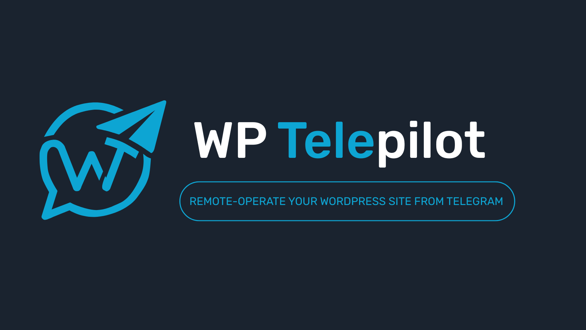

# WP Telepilot

WP Telepilot is a Telegram-first WordPress operations plugin for site owners, editors, and administrators who want a secure way to review site activity and perform structured actions from chat.

It links an approved Telegram account to a WordPress user, shows capability-aware menus, and gives teams a practical command surface for day-to-day operations without trying to turn Telegram into a full replacement for `wp-admin`.

## Links

- Product page: [alefdigitalsolutions.com/solutions/wp-telepilot](https://alefdigitalsolutions.com/solutions/wp-telepilot)
- Releases: [GitHub Releases](https://github.com/alefsolutions/wp-telepilot/releases)
- Command reference: [COMMANDS.md](COMMANDS.md)
- Report bugs: [alefdigitalsolutions.com/solutions/wp-telepilot](https://alefdigitalsolutions.com/solutions/wp-telepilot)

## Highlights

- Secure Telegram-to-WordPress account linking with short-lived one-time codes
- Webhook mode with polling fallback for environments where direct Telegram delivery is unreliable
- Role-aware menus and actions based on the linked WordPress user's actual capabilities
- Command groups for posts, pages, comments, media, users, plugins, categories, tags, notifications, and site settings
- Search, pagination, confirmations, and audit logging across the main management flows
- Guided post creation with in-chat follow-up actions
- Inline post category selection so users do not have to memorize category IDs
- Category-driven post creation, including creating a new draft directly from a chosen category
- Secure browser handoff for long-form post editing when chat is not the right editing surface
- Transport diagnostics for webhook health, polling health, queue activity, stale updates, and delivery failures
- Privacy integrations for WordPress personal-data export and erasure workflows

## What You Can Do

- Link a Telegram user to a WordPress user and restrict access with an allowed chat list
- Open `/menu` for a capability-aware Telegram command hub
- Review site status with `/site`
- Create, review, update, publish, draft, trash, restore, and browser-edit posts
- Review and manage pages, comments, users, plugins, categories, and tags
- Manage Telegram notification preferences from chat
- Update selected site settings from Telegram with controlled validation
- Inspect transport health and operational diagnostics from the WordPress admin panel

## Installation

1. Install and activate WP Telepilot in WordPress.
2. Create a Telegram bot with BotFather.
3. Open `WordPress Admin -> WP Telepilot`.
4. Paste the Telegram bot token into the settings page.
5. Choose `Webhook` or `Polling Fallback`.
6. Save the settings so WP Telepilot can sync transport details.
7. Generate a one-time link code from the user's WordPress profile.
8. In a private chat with the bot, send `/link CODE`.
9. Use `/menu`, `/site`, or `/help` to begin.

## Core Telegram Flows

- `/start` shows onboarding and current chat details
- `/menu` opens the command hub
- `/help` shows the available command surface
- `/chatid` shows the current Telegram chat ID
- `/posts new` starts a guided draft-creation flow
- `/posts categories POST_ID` opens the inline category picker for an existing post
- `/categories post TERM_ID` starts a new post with that category preselected
- `/notifications list` reviews Telegram alert preferences

For the full command surface, syntax, and examples, see [COMMANDS.md](COMMANDS.md).

## Transport Modes

### Webhook

Webhook mode is the preferred option for near-real-time Telegram replies. In this mode, Telegram sends updates directly to the WP Telepilot REST endpoint, and WP Telepilot validates the configured webhook secret before processing the request.

### Polling Fallback

Polling fallback is available for sites where webhooks are blocked, delayed, challenged by infrastructure, or otherwise unreliable. In this mode, WP Telepilot checks Telegram for updates through scheduled jobs instead of waiting for inbound webhook delivery.

## Security And Reliability

- Link codes are short-lived and stored server-side
- Sensitive actions are restricted to private chats
- Webhook requests validate the Telegram secret header
- Duplicate Telegram updates are ignored
- Stale Telegram updates are dropped
- Background queue processing is used for slower operations
- Polling uses a lock to prevent overlapping workers
- Destructive actions require confirmation
- Audit records are written for linking, moderation, content actions, and delivery events

## Admin Panel

From the WP Telepilot settings page, administrators can:

- configure the bot token
- choose webhook or polling transport
- manage the webhook secret
- restrict allowed chat IDs
- enable or disable user linking
- review webhook and worker diagnostics
- inspect queue, cron, schema, and database readiness
- refresh webhook status
- poll Telegram manually when polling mode is enabled
- process queued jobs
- flush pending Telegram updates

## Privacy And External Services

WP Telepilot connects to the Telegram Bot API only after an administrator configures a bot token.

When enabled, the plugin may send:

- the configured bot token as part of authenticated Bot API requests
- Telegram user and chat identifiers required to route responses
- webhook registration details in webhook mode
- response payloads generated from WordPress data that an authorized linked user explicitly requested

WordPress privacy-policy helper text, exporter callbacks, and eraser callbacks are included for linked Telegram data.

Telegram is a third-party service:

- Terms of service: [telegram.org/tos](https://telegram.org/tos)
- Privacy policy: [telegram.org/privacy](https://telegram.org/privacy)

## Requirements

- WordPress 6.6 or newer
- PHP 8.0 or newer
- HTTPS for webhook mode
- Current plugin line: `0.3.0-beta.4`

## Project Status

WP Telepilot is currently in the `0.3.0-beta.4` release line. The focus of the current cycle is reliability, admin polish, secure transport behavior, and smoother operator workflows ahead of the first stable release.

## Product Direction

WP Telepilot is designed around a simple principle:

> Telegram is for awareness, decisions, and short actions. WordPress remains the place for long-form editing, visual design, and complex configuration.

## License

WP Telepilot is licensed under the GNU General Public License, version 2 or later, the same license used by WordPress.
